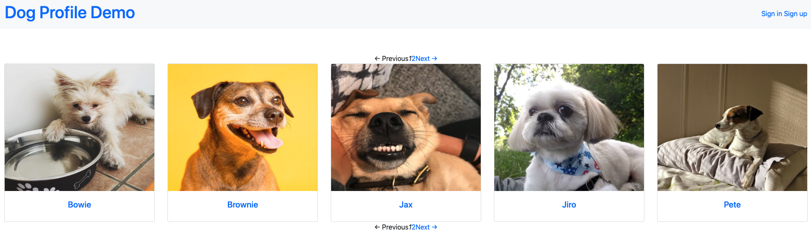
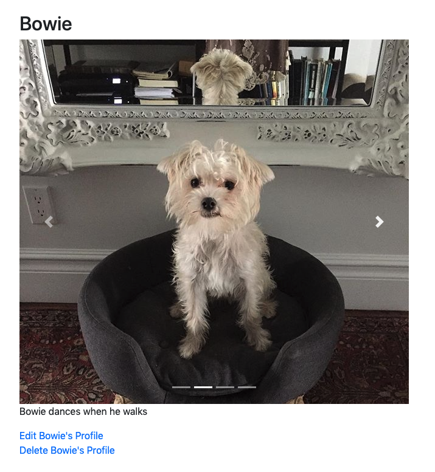

### Welcome

This repository contains starter code for a technical assessment. The challenges can be done at home before coming in to discuss with the Bark team or can be done as a pairing exercise at the Bark office. Either way, we don't expect you to put more than an hour or two into coding. We recommend forking the repository and getting it running before starting the challenge if you choose the pairing approach.

### Set up

Fork this repository and clone locally

You'll need [Ruby 2.5.7](https://rvm.io/rvm/install) and [Rails 5](https://guides.rubyonrails.org/v5.2/getting_started.html) installed.

Run `bundle install`

Initialize the data with `rake db:reset`

Run the specs with `rspec`

Run the server with `rails s`

View the site at http://localhost:3000

### Challenges

##### Backend/FullStack Devs

- Add pagination to index page, to display 5 dogs per page ✅
  
  - Used `Will_Paginate` library
- Add the ability ~~to~~ for a user to input multiple dog images on an edit form or new dog form ✅
  - Changed the input to a `file_field` instead of `input` field to enable multiple images to be selected
- Associate dogs with owners
  - Added DB migration with association and visual indication of the owner in the dog's show page
- Allow users to like other dogs (not their own)
- Allow sorting the index page by number of likes in the last hour
- Display the ad.jpg image (saved at app/assets/images/ad.jpg) after every 2 dogs in the index page, to simulate advertisements in a feed ✅
  - Added the collar image checking index of dogs in the each

##### Front End Devs

- On the dog detail page that has more than one profile image, (ex http://localhost:3000/dogs/1), display profile images in a functioning carousel ✅
  
- Feel free to use vanilla js or a carousel library ✅
  - Used Bootstrap carousel
- Use flexbox, CSS grids, or a grid framework to display the homepage's dog profile thumbnails in a responsive grid layout ✅
  - Since I imported bootstrap, the grid is responsive to browser size
- On mobile, the thumbnails should be 1 across, on tablet they should be 2 across, and on desktop they should be 3 across
- Use utility classes within a layout framework (Bootstrap, Foundation, Material Design, or another) to add a structured layout to the page without custom CSS
